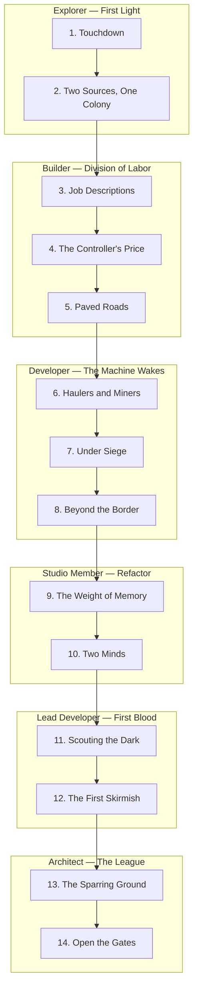

# Roadmap: The AutoNate Chronicles

This is the season plan. Every file in `docs/tutorials/` is an episode in AutoNate's run through the Foundry — the technical checkpoints are the real curriculum, the story is the reason to keep opening the next file.

Start at `docs/story/00-prologue.md` if you haven't. Terms and character rules live in `docs/story/bible.md`.

## How to Read This

- **Arc** — a block of episodes, matched to one rank on the Explorer → Architect ladder.
- **Episode** — one file in `docs/tutorials/`.
- **Status** — `Live` (written), `Coming next` (scoped, not yet written), `Planned` (named, not yet scoped).

## The Ladder

| Rank | Arc | Screeps Milestone | Track Focus |
| --- | --- | --- | --- |
| Explorer | First Light | RCL 1-2, one worker completes one clean loop | Track 1 + Track 2 basics |
| Builder | Division of Labor | RCL 2-4, roles, controller progress, first infrastructure | Track 2 |
| Developer | The Machine Wakes | RCL 4-6, logistics split, defense, second room | Track 2 |
| Studio Member | Refactor | Ongoing, CPU/Memory discipline, formal AI workflow | Track 2 + Track 3 |
| Lead Developer | First Blood | Scouting and PvP fundamentals | Track 1 + Track 3 |
| Architect | The League | Repeatable local combat iteration, tournament operations, mentoring the next drop | Track 4 |

## Arc I — Explorer: First Light

| # | Episode | Logline | Tutorial | Status |
| --- | --- | --- | --- | --- |
| 1 | Touchdown | Claim a room, place `Spawn1`, hand-spawn one harvester, close the harvest-to-transfer loop, add auto-respawn. | `docs/tutorials/01-first-spawn-and-harvester.md` | Live |
| 2 | Two Sources, One Colony | Stop every harvester from fighting over `sources[0]` by assigning sources through Memory. | `docs/tutorials/02-target-selection.md` | Live |

## Arc II — Builder: Division of Labor

| # | Episode | Logline | Tutorial | Status |
| --- | --- | --- | --- | --- |
| 3 | Job Descriptions | Split the one hardcoded script into harvester/upgrader roles; spawn by role count instead of by name. | `docs/tutorials/03-roles.md` | Live |
| 4 | The Controller's Price | Route energy into `upgradeController`; watch RCL climb and extensions unlock. | `docs/tutorials/04-controller-upgrading.md` | Live |
| 5 | Paved Roads | Construction sites, roads, and containers; separate "stand and harvest" from "carry and deliver." | `docs/tutorials/05-construction-and-roads.md` | Live |

## Arc III — Developer: The Machine Wakes

| # | Episode | Logline | Tutorial | Status |
| --- | --- | --- | --- | --- |
| 6 | Haulers and Miners | Static miners drop energy into containers; dedicated haulers move it. The logistics split gets real. | `docs/tutorials/06-haulers-and-static-mining.md` | Live |
| 7 | Under Siege | First invader wave. Towers, ramparts, and the gap between "safe" and "undefended." | `docs/tutorials/07-defense.md` | Live |
| 8 | Beyond the Border | Claim or reserve a second room; remote mining and cross-room creep routing. | `docs/tutorials/08-expansion.md` | Live |

## Arc IV — Studio Member: Refactor

| # | Episode | Logline | Tutorial | Status |
| --- | --- | --- | --- | --- |
| 9 | The Weight of Memory | CPU budgeting, Memory hygiene, caching — code that survives its own growth. | `docs/tutorials/09-cpu-and-memory.md` | Live |
| 10 | Two Minds | Formalize the AI-collaboration workflow: which prompts unstick a bug, when to reject a suggestion, how to review AI-written code before it runs on a live colony. | `docs/tutorials/10-ai-collaboration.md` | Live |

## Arc V — Lead Developer: First Blood

| # | Episode | Logline | Tutorial | Status |
| --- | --- | --- | --- | --- |
| 11 | Scouting the Dark | Reading a room you don't own; gathering intel before committing creeps or Memory to it. | `docs/tutorials/11-scouting.md` | Live |
| 12 | The First Skirmish | PvP fundamentals: boosted creeps, rampart tanking, reading a fight you didn't start. | `docs/tutorials/12-pvp-fundamentals.md` | Live |

## Arc VI — Architect: The League

| # | Episode | Logline | Tutorial | Status |
| --- | --- | --- | --- | --- |
| 13 | The Sparring Ground | Turn one Invasion-panel test into a repeatable wave-based training loop on this repo's own local server — no internet, no Steam, no Arena required. | `docs/tutorials/13-sparring-ground.md` | Live |
| 14 | Open the Gates | AutoNate stops playing solo and starts running the league: submissions, scoring, replays, and the next architect's drop pod. | `docs/tutorials/14-running-the-league.md` | Live |

## Local Competition Modules

`docs/competitions/README.md` turns the tutorial ladder into replayable NPC/bot challenges. These modules are designed for program labs: short setup, explicit pressure, measurable win condition, reflection, and a clean replay path.

## Notes for Future Episodes

- Each episode's cold open should pick up exactly where the previous episode's closing hook left off — no time skips without a reason.
- A tutorial's checklist and checkpoints are written first; the narrative wraps around a working, tested set of steps, never the other way around.
- When an episode's status changes to `Live`, update its row here in the same commit.
