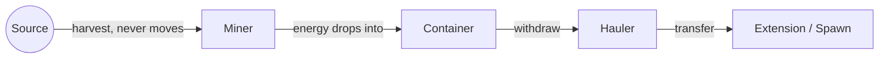

# Tutorial 06: Haulers and Static Mining

*Episode 6: Haulers and Miners*

"Your harvesters spend more time walking than harvesting," your collaborator says. "Every round trip is dead time — no energy coming out of the ground while a creep's mid-hallway doing nothing useful."

It has a fix, and it's uncomfortable at first: stop making creeps that do both jobs. Sound familiar? It's the same conversation every ten-person startup has right before they hire a specialist instead of another generalist.

"One creep stands on the source and never moves again. Another creep does nothing but carry. Neither one is as flexible as what you've got now. Both together ship more than what you've got now — that's the whole argument for specialization in one sentence."

## Goal

Retire the general-purpose harvester role in favor of two specialists:

- `role.miner.js` — a `WORK`-heavy creep that plants itself on a source and never stops harvesting
- `role.hauler.js` — a `CARRY`-heavy creep that moves energy from containers to wherever it's needed
- A `ROLE_BODIES` table in `main.js`, so different roles finally spawn with different bodies

## Prerequisites

Tutorial 05 is complete:

- A container exists adjacent to each source (built or nearly built).
- `role.harvester.js`, `role.upgrader.js`, and `role.builder.js` exist.
- `room.energyCapacityAvailable` is `550` if all five Episode 4 extensions are complete. If it's lower, finish those extensions first — the miner body in this episode costs `550` and won't spawn without it.

## Step 1: Do the Math on a Static Miner

Each `WORK` part harvests `2` energy per tick from a source. A source regenerates `3000` energy every `300` ticks — an average of `10` energy per tick. Five `WORK` parts harvest exactly `10` per tick, matching the source's regeneration rate with nothing wasted.

```text
5 WORK  = 500 energy to build
1 MOVE  = 50 energy to build
------------------------
Total   = 550 energy
```

That's not a coincidence with where your extensions left you. This body is designed to cost exactly what a maxed-out RCL2 room can afford.

## Step 2: Create `role.miner.js`

```js
const roleMiner = {
  run(creep) {
    if (!creep.memory.sourceId) {
      creep.memory.sourceId = assignSource(creep);
    }
    const source = Game.getObjectById(creep.memory.sourceId);
    if (creep.harvest(source) === ERR_NOT_IN_RANGE) {
      creep.moveTo(source, { visualizePathStyle: { stroke: '#ffaa00' } });
    }
  },
};

function assignSource(creep) {
  const sources = creep.room.find(FIND_SOURCES);
  const claimed = _.map(Game.creeps, (other) => other.memory.sourceId).filter(Boolean);
  const open = sources.find((source) => !claimed.includes(source.id));
  return (open || sources[0]).id;
}

module.exports = roleMiner;
```

This creep has no `CARRY` parts. When it harvests, the energy has nowhere to go in its own inventory — it drops at the creep's feet. If that tile has a container on it (the ones you built in Episode 5), the energy goes into the container automatically instead of piling on the ground. That's why the container's position mattered: it has to be a tile within harvesting range of the source.

> 📸 **Screenshot placeholder:** A miner standing motionless on a container tile next to a source, with the container's energy count visibly climbing — the visual proof that "never moves again" actually works.

## Step 3: Create `role.hauler.js`

```js
const roleHauler = {
  run(creep) {
    if (creep.memory.hauling && creep.store[RESOURCE_ENERGY] === 0) {
      creep.memory.hauling = false;
    }
    if (!creep.memory.hauling && creep.store.getFreeCapacity() === 0) {
      creep.memory.hauling = true;
    }

    if (creep.memory.hauling) {
      const target = creep.pos.findClosestByPath(FIND_STRUCTURES, {
        filter: (structure) =>
          (structure.structureType === STRUCTURE_EXTENSION || structure.structureType === STRUCTURE_SPAWN) &&
          structure.store.getFreeCapacity(RESOURCE_ENERGY) > 0,
      });
      if (!target) {
        return;
      }
      if (creep.transfer(target, RESOURCE_ENERGY) === ERR_NOT_IN_RANGE) {
        creep.moveTo(target, { visualizePathStyle: { stroke: '#ffffff' } });
      }
      return;
    }

    const container = creep.pos.findClosestByPath(FIND_STRUCTURES, {
      filter: (structure) => structure.structureType === STRUCTURE_CONTAINER && structure.store[RESOURCE_ENERGY] > 0,
    });
    if (container && creep.withdraw(container, RESOURCE_ENERGY) === ERR_NOT_IN_RANGE) {
      creep.moveTo(container, { visualizePathStyle: { stroke: '#ffaa00' } });
    }
  },
};

module.exports = roleHauler;
```

The hauler never harvests. It withdraws from containers and delivers to whatever still has open capacity — extensions first in practice, since `findClosestByPath` picks nearest, but it'll fall back to the spawn once extensions are full.

The full logistics chain, once both roles are running:



Compare that to the general-purpose harvester from Episode 2: one creep doing all four of these steps itself, walking back and forth the entire time. This is the same total work, split so that harvesting never stops to let a creep walk anywhere.

## Step 4: Give Every Role Its Own Body

Replace `main` with a version that spawns each role with a body suited to its job:

```js
const roleUpgrader = require('role.upgrader');
const roleBuilder = require('role.builder');
const roleMiner = require('role.miner');
const roleHauler = require('role.hauler');

const ROLE_BODIES = {
  upgrader: [WORK, CARRY, MOVE],
  builder: [WORK, CARRY, MOVE],
  miner: [WORK, WORK, WORK, WORK, WORK, MOVE],
  hauler: [CARRY, CARRY, CARRY, CARRY, MOVE, MOVE, MOVE, MOVE],
};

const POPULATION = {
  miner: 2,
  hauler: 2,
  upgrader: 1,
  builder: 1,
};

module.exports.loop = function () {
  for (const name in Memory.creeps) {
    if (!Game.creeps[name]) {
      delete Memory.creeps[name];
    }
  }

  spawnMissingRoles();

  for (const name in Game.creeps) {
    const creep = Game.creeps[name];
    if (creep.memory.role === 'upgrader') {
      roleUpgrader.run(creep);
    } else if (creep.memory.role === 'builder') {
      roleBuilder.run(creep);
    } else if (creep.memory.role === 'miner') {
      roleMiner.run(creep);
    } else if (creep.memory.role === 'hauler') {
      roleHauler.run(creep);
    }
  }
};

function spawnMissingRoles() {
  const spawn = Game.spawns.Spawn1;
  if (spawn.spawning) {
    return;
  }

  for (const role in POPULATION) {
    const currentCount = _.filter(Game.creeps, (creep) => creep.memory.role === role).length;
    if (currentCount < POPULATION[role]) {
      const name = `${role}${Game.time}`;
      spawn.spawnCreep(ROLE_BODIES[role], name, { memory: { role } });
      break;
    }
  }
}
```

Notice `role: 'harvester'` is gone from both the require list and the dispatch loop. `role.harvester.js` can stay in the editor unused — Screeps doesn't mind orphaned files — but nothing spawns with that role anymore.

## Step 5: Retire the Old Harvesters

```js
_.filter(Game.creeps, (creep) => creep.memory.role === 'harvester').forEach((creep) => creep.suicide());
```

Checkpoint:

- Miners spawn and walk to their assigned source, then stop moving entirely once in range.
- Haulers spawn, withdraw from containers, and deliver to extensions/spawn.
- The colony keeps running without any general-purpose harvester in the mix.

## Step 6: Confirm the Split Actually Worked

```js
_.map(Game.creeps, (creep) => [creep.name, creep.memory.role])
```

Expected result: a mix of `miner`, `hauler`, `upgrader`, and `builder`, no `harvester`.

```js
Game.spawns.Spawn1.room.find(FIND_STRUCTURES, { filter: { structureType: STRUCTURE_CONTAINER } }).map((c) => c.store[RESOURCE_ENERGY])
```

Expected result: values that rise and fall as miners deposit and haulers withdraw, instead of sitting permanently at `0` or permanently full.

## Troubleshooting

If a miner never stops moving, it likely couldn't get an assigned source — check `creep.memory.sourceId` against `creep.room.find(FIND_SOURCES).map(s => s.id)`.

If energy piles up on the ground instead of in a container, the miner isn't standing on the container tile. Confirm the container's position matches where the miner ends up:

```js
Game.creeps['<miner-name>'].pos
```

If haulers stand idle, confirm containers actually have energy in them, and that extensions/spawn aren't already full:

```js
Game.spawns.Spawn1.room.find(FIND_STRUCTURES, { filter: { structureType: STRUCTURE_CONTAINER } }).map((c) => c.store[RESOURCE_ENERGY])
Game.spawns.Spawn1.store.getFreeCapacity(RESOURCE_ENERGY)
```

If `spawnCreep` fails with `-6` for a miner, `energyCapacityAvailable` is below `550` — an extension is missing or was destroyed.

## Completion Criteria

You are done when:

- No creep has `memory.role === 'harvester'`.
- At least one miner is stationary on a source-adjacent container tile, harvesting every tick.
- At least one hauler is actively moving energy from a container to the spawn or an extension.
- `ROLE_BODIES` gives each role a body suited to its job, not the same three parts for everyone.

## Learning Notes

After completing the tutorial, write down:

- How much energy per tick is this room producing now, compared to your estimate from two mobile harvesters in Episode 2?
- What happens if a miner dies and its container already has a full 2000-capacity stockpile sitting in it when the replacement spawns?
- The hauler body has no `WORK` parts at all. What job could it never do, no matter how you changed its code?
- If a third source existed in this room, what's the minimum change needed to mine it?

## Next: Episode 7 — Under Siege

The colony finally runs itself. That was always going to attract attention.

"Nothing's approached this room yet," your collaborator says, "but it will. And when it does, none of these five roles know how to fight, and nothing in this room can hurt an attacker back. You've built a nice office with no lock on the door."

See `docs/roadmap.md` for the full season.
