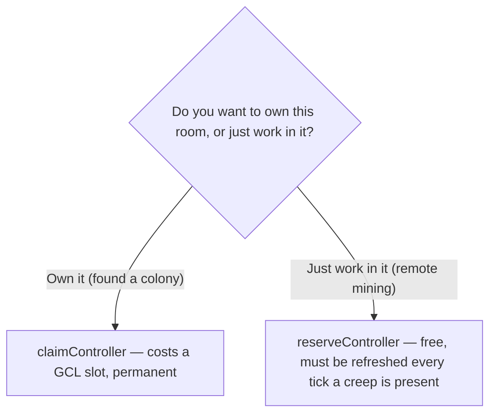

# Tutorial 08: Expansion

*Episode 8: Beyond the Border*

"You've been treating this room like the whole world," your collaborator says. "It's one room. There are exits on all four sides, and every one of them leads somewhere you haven't looked yet — this is the 'have you considered a second market' conversation, except the market is an actual adjacent room."

You pull up the room's exits for the first time since you landed. Four directions. Four unknowns.

## Goal

Extend the colony's reach one room past its border without giving up ownership of it:

- List this room's exits and pick a neighbor
- Understand the difference between claiming and reserving a controller
- Send a reserver to hold a remote room's controller
- Add remote mining: a miner and hauler pair that cross a room boundary and bring energy home

## Prerequisites

Tutorial 07 is complete:

- The room is RCL3 with a fueled, firing tower.
- `role.miner.js`, `role.hauler.js`, `role.upgrader.js`, and `role.builder.js` are all running.

## Step 1: List Your Exits

```js
Game.map.describeExits(Game.spawns.Spawn1.room.name)
```

Expected result: an object like `{ "1": "W7N4", "3": "W6N3", "5": "W7N2", "7": "W8N3" }`. The keys are direction constants (`1` = top, `3` = right, `5` = bottom, `7` = left); the values are the adjacent room names.

Pick one. Move a creep or scroll the client map into it to confirm it's unowned — an empty `controller.owner` and no hostile structures. If this server has an NPC bot placed (see `docs/local-screeps.md`), check that it hasn't already claimed the room you're eyeing — `controller.owner.username` would show the bot's name (`simplebot` or `tooangel`) instead of being empty.

Store your choice where the rest of this tutorial's code can find it:

```js
Memory.remoteRoom = 'W6N3';
```

Use the actual room name you picked, not this example.

## Step 2: Raise Capacity for a Claim-Class Creep

Both claiming and reserving a controller require at least one `CLAIM` body part, and `CLAIM` costs `600` energy on its own — `650` with a `MOVE` part attached. If `room.energyCapacityAvailable` is still `550` from Episode 6, this body won't spawn.

RCL3 allows up to 10 extensions (see the table in Episode 4). Place a few more using the same pattern:

```js
const room = Game.spawns.Spawn1.room;
room.createConstructionSite(26, 24, STRUCTURE_EXTENSION);
room.createConstructionSite(27, 24, STRUCTURE_EXTENSION);
```

Let the builder finish them.

Checkpoint:

```js
Game.spawns.Spawn1.room.energyCapacityAvailable
```

Expected result: `650` or higher.

## Step 3: Claim vs. Reserve

Claiming a controller makes you the room's owner. It counts permanently against your Global Control Level (GCL) — a limit on how many rooms you're allowed to own at once. A brand-new architect usually has a GCL of `1`, meaning your home room is already using your only slot.

Reserving a controller doesn't transfer ownership and doesn't cost GCL. It grants your creeps the right to work in that room — harvest its sources, build in it — without claiming it as a colony. That's what remote mining is built on.

For this episode, reserve. Save claiming for when you're deliberately founding a second full colony.



## Step 4: Add `role.reserver.js`

```js
const roleReserver = {
  run(creep) {
    const targetRoom = Memory.remoteRoom;
    if (creep.room.name !== targetRoom) {
      creep.moveTo(new RoomPosition(25, 25, targetRoom));
      return;
    }

    const controller = creep.room.controller;
    if (creep.reserveController(controller) === ERR_NOT_IN_RANGE) {
      creep.moveTo(controller, { visualizePathStyle: { stroke: '#ffffff' } });
    }
  },
};

module.exports = roleReserver;
```

`reserveController` has to be called every tick the creep is in range — reservation ticks down when nobody's refreshing it. A single reserver camped on the controller keeps it held indefinitely.

## Step 5: Add Remote Mining

Two more roles. `role.remoteMiner.js` travels to the target room and harvests without a container to catch the overflow — it doesn't own the room, so build sparingly there:

```js
const roleRemoteMiner = {
  run(creep) {
    const targetRoom = Memory.remoteRoom;
    if (creep.room.name !== targetRoom) {
      creep.moveTo(new RoomPosition(25, 25, targetRoom));
      return;
    }

    if (!creep.memory.sourceId) {
      const source = creep.room.find(FIND_SOURCES)[0];
      creep.memory.sourceId = source.id;
    }

    const source = Game.getObjectById(creep.memory.sourceId);
    if (creep.harvest(source) === ERR_NOT_IN_RANGE) {
      creep.moveTo(source, { visualizePathStyle: { stroke: '#ffaa00' } });
    }
  },
};

module.exports = roleRemoteMiner;
```

`role.remoteHauler.js` follows it in, picks up what piles on the ground, and carries it home:

```js
const roleRemoteHauler = {
  run(creep) {
    if (creep.memory.hauling && creep.store[RESOURCE_ENERGY] === 0) {
      creep.memory.hauling = false;
    }
    if (!creep.memory.hauling && creep.store.getFreeCapacity() === 0) {
      creep.memory.hauling = true;
    }

    if (creep.memory.hauling) {
      if (creep.room.name !== Game.spawns.Spawn1.room.name) {
        creep.moveTo(new RoomPosition(25, 25, Game.spawns.Spawn1.room.name));
        return;
      }
      const target = creep.pos.findClosestByPath(FIND_STRUCTURES, {
        filter: (structure) =>
          (structure.structureType === STRUCTURE_EXTENSION || structure.structureType === STRUCTURE_SPAWN) &&
          structure.store.getFreeCapacity(RESOURCE_ENERGY) > 0,
      });
      if (target && creep.transfer(target, RESOURCE_ENERGY) === ERR_NOT_IN_RANGE) {
        creep.moveTo(target, { visualizePathStyle: { stroke: '#ffffff' } });
      }
      return;
    }

    const targetRoom = Memory.remoteRoom;
    if (creep.room.name !== targetRoom) {
      creep.moveTo(new RoomPosition(25, 25, targetRoom));
      return;
    }

    const pile = creep.pos.findClosestByPath(FIND_DROPPED_RESOURCES, {
      filter: (resource) => resource.resourceType === RESOURCE_ENERGY,
    });
    if (pile && creep.pickup(pile) === ERR_NOT_IN_RANGE) {
      creep.moveTo(pile, { visualizePathStyle: { stroke: '#ffaa00' } });
    }
  },
};

module.exports = roleRemoteHauler;
```

## Step 6: Wire the New Roles In

```js
const roleReserver = require('role.reserver');
const roleRemoteMiner = require('role.remoteMiner');
const roleRemoteHauler = require('role.remoteHauler');

const ROLE_BODIES = {
  upgrader: [WORK, CARRY, MOVE],
  builder: [WORK, CARRY, MOVE],
  miner: [WORK, WORK, WORK, WORK, WORK, MOVE],
  hauler: [CARRY, CARRY, CARRY, CARRY, MOVE, MOVE, MOVE, MOVE],
  reserver: [CLAIM, MOVE],
  remoteMiner: [WORK, WORK, WORK, WORK, WORK, MOVE],
  remoteHauler: [CARRY, CARRY, CARRY, CARRY, MOVE, MOVE, MOVE, MOVE],
};

const POPULATION = {
  miner: 2,
  hauler: 2,
  upgrader: 1,
  builder: 1,
  reserver: 1,
  remoteMiner: 1,
  remoteHauler: 1,
};
```

Add matching `else if` branches to the dispatch loop for `reserver`, `remoteMiner`, and `remoteHauler`, the same pattern as every role before it.

Checkpoint:

- A reserver leaves the home room and doesn't come back.
- `Game.map.describeExits` confirms the target room name matches `Memory.remoteRoom`.

```js
Game.rooms[Memory.remoteRoom] && Game.rooms[Memory.remoteRoom].controller.reservation
```

Expected result, once the reserver is in place: an object with a `username` matching yours and a `ticksToEnd` that resets upward each tick instead of counting down to zero.

> 📸 **Screenshot placeholder:** The remote room's map view showing your reservation banner on its controller — the visual difference between "a room you glanced at" and "a room your creeps actually have rights to work in."

## Step 7: Confirm Energy Is Flowing Home

```js
Game.spawns.Spawn1.room.energyAvailable
```

Watch this over time. If remote mining is working, this number should recover faster than it did with only local miners feeding it — the room now has more total income than it did in Episode 6.

## Troubleshooting

If a creep won't leave the home room, confirm `Memory.remoteRoom` is set to a real, spelled-correctly room name and that `RoomPosition(25, 25, targetRoom)` isn't inside a wall in that room (some rooms have terrain at the exact center).

If `reserveController` returns `-7` (invalid target), confirm the room isn't already owned or reserved by another player — pick a different exit.

If the remote hauler never finds anything to pick up, confirm the remote miner is actually harvesting: `Game.creeps['<remote-miner-name>'].room.name` should equal `Memory.remoteRoom`.

## Completion Criteria

You are done when:

- A reserver holds `Memory.remoteRoom`'s controller with a `reservation.ticksToEnd` that isn't decaying to zero.
- A remote miner is harvesting in that room.
- A remote hauler is moving energy from that room back into the home room's spawn or extensions.
- `room.energyAvailable` in the home room reflects the added income.

## Learning Notes

After completing the tutorial, write down:

- What happens to the reservation if the reserver dies and isn't replaced quickly?
- Why does remote mining use dropped-resource pickup instead of a container, when local mining in Episode 6 used a container?
- What's the actual GCL cost of what you just did — reserving a room — versus what claiming it would have cost?
- If a hostile creep showed up in the remote room, what would happen to your remote miner and hauler? Does anything in this episode's code account for that?

## Next: Episode 9 — The Weight of Memory

Nine roles now. Two rooms. More creeps than you've ever run at once.

"Every one of these creeps runs its logic every single tick," your collaborator says. "So far that's been free. It stops being free the moment CPU becomes the thing you're managing instead of energy — welcome to your first real infra bill."

See `docs/roadmap.md` for the full season.
